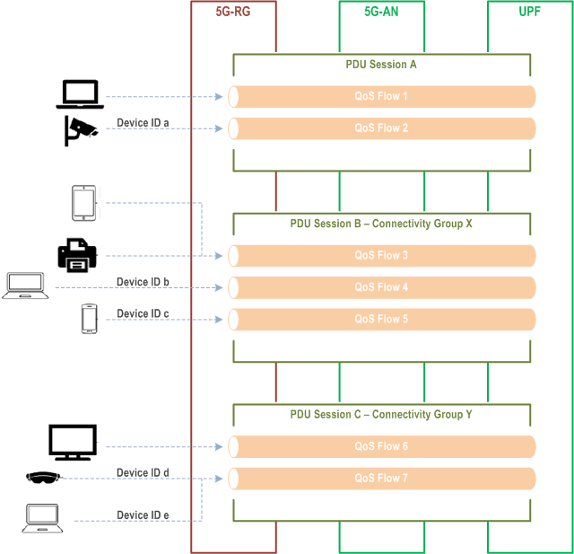

 &nbsp;  &nbsp; 

# Integration of Wi-Fi-Only Devices in 5G Core Networks: Addressing Authentication and Identity Management Challenges

<div class="columns2">
<div>

###### Author

David Araújo, _DETI_, _IT_
_davidaraujo@ua.pt_

</div>
<div>

###### Supervisors

Doctor Daniel Nunes Corujo, _DETI_, _IT_
Doctor Francisco Fontes, _Altice Labs_

</div>
</div>

<!-- header: Masters in Cybersecurity -->
<!-- footer: June 2025 &nbsp;—&nbsp; Aveiro, PT-->
---
<!-- paginate: true -->
<!-- header: Masters in Cybersecurity — Integration of Wi-Fi-Only Devices in 5G Core Networks: Addressing Authentication and Identity Management Challenges -->
<!-- footer:  &ensp;  &ensp;  &ensp; Instituto de Telecomunicações, Altice Labs and DETI-->

# Table of Contents

<div class="columns2">
<div>

1. The Core Problem and Its Significance
2. Research Objectives
3. State of the Art and The Specific Gap
4. Framework Concept and Architecture
5. Key Mechanisms: Authentication, Identity, Traffic

</div>
<div>

6. Implementation: Testbed and Orchestration Logic
7. Validation: Key Results
8. Conclusion and Contributions
9. Limitations and Future Work

</div>
</div>

---

# The Core Problem and Its Significance

<div class="columns3">
<div>

## The Challenge

Current 3GPP standards don't fully address integrating **Wi-Fi-only devices lacking 5G credentials** into the 5G network, preventing standard 5G authentication.

</div>
<div>

## Impact

A significant hurdle for enterprise/residential environments with many such devices.

</div>
<div>

## Motivation

Solving this is crucial for 5G's success, enabling true **5G-Wi-Fi convergence** and extending 5G benefits (eMBB, mMTC, URLLC) to this vast device ecosystem.

</div>
</div>

---

# Research Objectives

To address this problem, this research aimed to:

1. **Investigate Secure Authentication:** Design a robust local authentication mechanism.
2. **Develop Device Identity Management:** Propose a method for 5GC to recognize and manage these device connections individually.
3. **Propose an Integrated Solution:** Develop a framework for seamless, secure integration with minimal impact.

---

# State of the Art

## The Gap

<div class="columns2">
<div>

**Non-3GPP Capable Device Types Behind RGs**

- **N5GC** have limited 5G capabilities but can authenticate
- **NAUN3** have no 5G capabilities and cannot directly authenticate and are often grouped.

</div>
<div>

A robust mechanism for **individualized**, **secure authentication** of _credential-less_ Wi-Fi-only devices and their subsequent per-device management within the 5GC is the focus of this project.

</div>
</div>

---

###### State of the Art

## Managing Device Groups (CGID)

<div class="columns2">
<div>

Connectivity Group ID (CGID) can manage **groups of devices behind** a 5G-RG.

The 5G-RG establishes one PDU Session for the entire group.

Thi dos not provide per-device traffic management granularity.

</div>
<div>


</div>
</div>

---

###### State of the Art

<div class="columns2">
<div>

## Industry Direction (3GPP R19)

3GPP introduced advancements in R19.

Allows the network to distinguish traffic from specific devices behind an RG.
Can trigger a PDU Session modification or establishment for a single device.

Industry is moving towards more granular, per-device management.

</div>
<div>



</div>
</div>

---

# Framework Concept and Architecture

## Overview and Guiding Principles

A _smart_ 5G Residential Gateway (5G-RG) capable of mediating the secure integration.

<div class="columns2">
<div>

### Key Design Principles

- Adaptation logic centralized at the 5G-RG.
- Minimal impact on end-devices and 5GC.

</div>
<div>


</div>
</div>

---

###### Framework Concept and Architecture

## Overall Architecture


---

<div class="columns2">
<div>

###### Framework Concept and Architecture

## Authentication Mechanism

EAP-TLS is used for mutual, certificate-based local authentication.

- NAUN3 Device (**Supplicant**): Holds a client certificate.
- 5G-RG (**Authenticator**/Relay): Uses hostapd to relay EAP messages.
- RADIUS **Authentication Server**: ISP-operated, validates the device's certificate.

</div>
<div>


</div>
</div>

---

###### Framework Concept and Architecture

## Identity Management (PDU Session as Proxy)

<div class="columns2">
<div>

After successful EAP-TLS authentication:

1. The 5G-RG requests a **new, dedicated** PDU Session.
2. This PDU Session becomes the **dynamic proxy identity** for the NAUN3.
3. The 5G-RG maintains a **mapping table** with NAUN3 MAC Addresses to PDU Session ID.

</div>
<div>


</div>
</div>

---

###### Framework Concept and Architecture

## Traffic Management and Policy-Based Routing

<div class="columns2">
<div>

1. **Packet Marking:** Incoming packets from the NAUN3's MAC are marked.
2. **Policy Routing:** Marked packets are directed to a specific table.
3. **Dedicated Route:** Traffic is routed via to a unique PDU interface.
4. **NAT:** Traffic is then masqueraded using the PDU session's 5GC-assigned IP address.

</div>
<div>


</div>
</div>

---

# Testbed, Components, and _Interceptor_ Logic


---

###### Testbed, Components, and _Interceptor_ Logic

**Virtualized testing environment** with Vagrant, Open5GS, UERANSIM, FreeRADIUS, hostapd, and wpa_supplicant.

<div class="columns2">
<div>

The custom logic developed, _Interceptor_, is the **brain of the solution**.

It's role is to **monitor for successful authentication**, orchestrate **PDU session creation** and attribution, manage **local DHCP permissions**, and **control all routing rules**.

</div>
<div>


</div>
</div>

---

# Validation 

## Successful Onboarding and PDU Creation

<div class="columns2">
<div>

Local EAP-TLS authentication was consistently successful.

Each authenticated NAUN3 device triggered the 5G-RG to establish a unique, **dedicated "clients" PDU session**, and the 5GC assigned a **unique IP to each session**.

</div>
<div>


```
PDU Session2: 
 state: PS-ACTIVE
 session-type: IPv4
 apn: clients
 s-nssai: 
  sst: 0x01
  sd: null
 emergency: false
 address: 10.46.0.2
 ambr: up[1000000Kb/s] down[1000000Kb/s]
 data-pending: false
```

</div>
</div>

---

###### Validation

## End-to-End Connectivity and Traffic Isolation

<div class="columns2">
<div>

```
PING 10.46.0.1 (10.46.0.1) 56(124) bytes of data .
64 bytes from 10.46.0.1: icmp_seq =1 ttl =63 time =1.52 ms
RR :    192.168.59.100
    10.46.0.2
    10.46.0.1
    10.46.0.1
    192.168.59.10
    192.168.59.100
(...)
```

```
PING 10.46.0.1 (10.46.0.1) 56(124) bytes of data .
64 bytes from 10.46.0.1: icmp_seq =1 ttl =63 time =2.31 ms
RR :    192.168.59.15
    10.46.0.3
    10.46.0.1
    10.46.0.1
    192.168.59.10
    192.168.59.15
(...)
```

</div>
<div>

Using `ping -R` and `iperf3` we can confirm that traffic from different NAUN3 devices was **correctly and separately routed through their respective PDU session IPs**, confirming successful **traffic isolation** and NAT.

</div>
</div>

---

###### Validation

## Lifecycle Management and Onboarding Delay

**Onboarding Delay:** The average time for the full process (EAP auth, PDU setup, local IP) was approximately 33 (± 5) seconds in the testbed.

<div class="columns2">
<div>

**Lifecycle:** When a device disconnected, the system correctly deauthenticated it, cleaned up all routing rules and DHCP permissions, and terminated the dedicated PDU session.

</div>
<div>

1. ☑ Deauthenticate
2. ☑ Disallow DHCP lease
3. ☑ Release dedicated PDU Session
4. ☑ Remove routing table

</div>
</div>

---

# Key Contributions

1. A practical, end-to-end framework for integrating _5G-credential-less_ Wi-Fi-only devices into 5G.
2. The innovative use of **per-device PDU Sessions as dynamic proxy identities**, orchestrated by an intelligent 5G-RG.
3. The tight coupling of strong, local EAP-TLS authentication with 5G PDU session management at the network edge.
4. A working proof-of-concept validating the architecture with open-source tools and custom logic.

---

# Limitations

- **Onboarding Delay:** Approximately 33s in the PoC.
- **Scalability:** Not stress-tested; CLI-based orchestration is a potential bottleneck.
- **NAT Implications:** Restricts inbound connection initiation to NAUN3 devices.
- **Physical Hardware:** Challenges encountered with physical modem integration.
- **Security:** The custom _Interceptor_ logic requires further hardening for production environments.

---

# Future Work

- **Optimize Onboarding Delay:** Explore API-based PDU control or pre-established session pools.
- **Performance and Scalability Analysis:** Rigorous testing and exploring alternatives like eBPF.
- **Enhanced Security:** Harden the _Interceptor_ and secure RADIUS transport (e.g., with IPSec).
- **Address NAT:** Investigate solutions like Framed-Route or UPF port forwarding.

---

# Thank You and Q&A

<div class="columns2">
<div>

## Author

David Araújo, _DETI_, _IT_
_davidaraujo@ua.pt_

</div>
<div>

## Supervisors

Doctor Daniel Nunes Corujo, _DETI_, _IT_
Doctor Francisco Fontes, _Altice Labs_

</div>
</div>

## In Colaboration With
 &nbsp;  &nbsp; 
